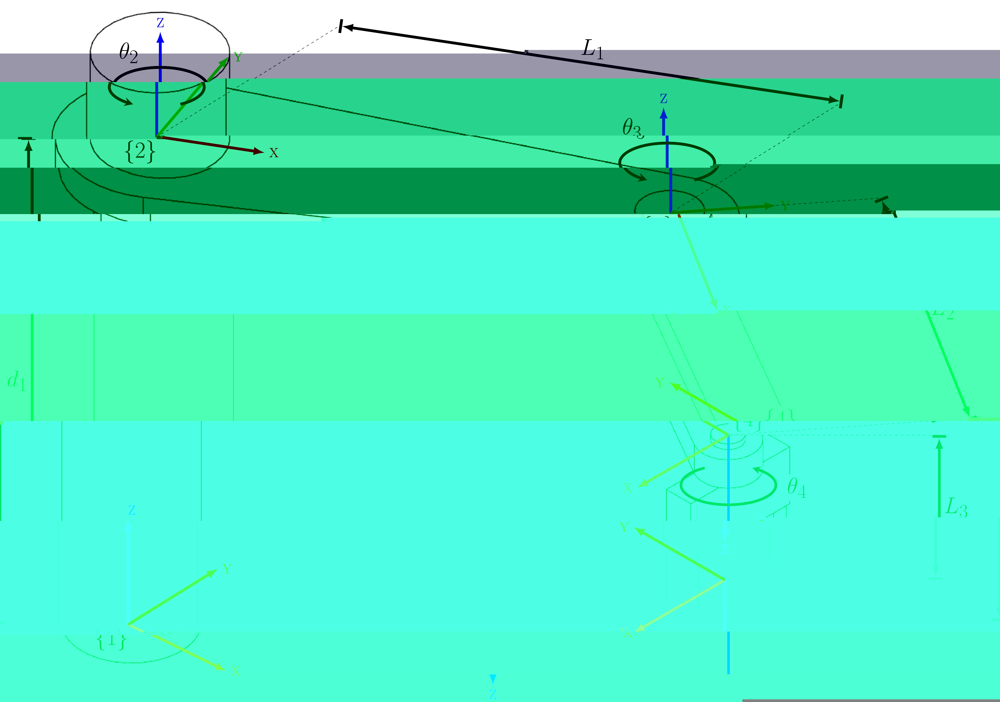

# Lab Assigment 3: Forward and Inverse Kinematis
The purpose of this lab assignment is to learn how to move a robot around, either by controlling the joint values or give it coordinates to move to.

## Task 1: Analytical Inverse Kinematics
See the figure below

Let $L_1=0.75\text{m}$, $L_2=0.50\text{m}$ and $L_3=0.20\text{m}$. Where $d_1$, $\theta_2$, $\theta_3$ and $\theta_4$ are joints that can move the robot.

### Task 1a
How many DoF does this robot have?

### Task 1b
What singularities does it have? And which ones are physically possible to reach and which are not?

### Task 1c
Assume that $d_1$ and $\theta_3$ are fixed, such that the gripper is touching the table, and that therefore $z=0$. We only focus on moving the robot along the $xy$-plane. Write an equation 
$$
\left[\begin{matrix}\theta_2\\\theta_3\end{matrix}\right] = f(x,y)
$$
so that you can determine the correct $\theta_2$ and $\theta_3$ given an $(x,y)$ coordinate.

### Task 1d
Expand the equation $f(x,y)$ to 
$$
\left[\begin{matrix}d_1\\\theta_2\\\theta_3\\\theta_4\end{matrix}\right] = f(x,y,z,\phi)
$$
such $d_1$ moves the arm up or down from 0 to 1 meter.

## Task 2: Path Planning
Given the 

## Task 3: Commanding a Robot

## Task 4: 